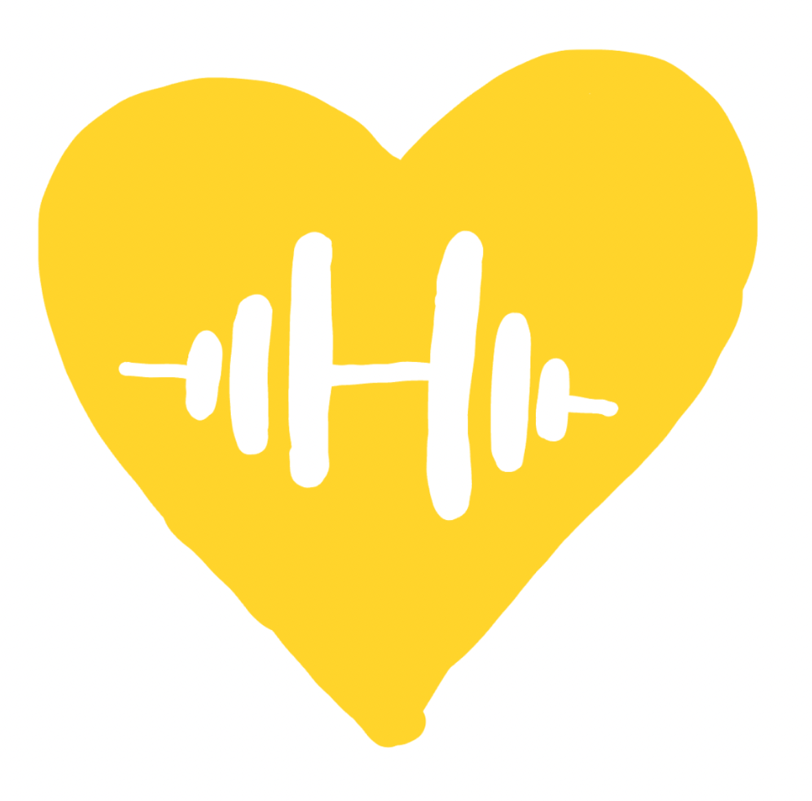

<!-- PROJECT LOGO -->
<br />
<div align="center">
  <a href="/">
    
  </a>

<h3 align="center">Let's Get Physical</h3>

  <p align="center">
    Dating-style app to help college students find friends to attend the gym
    <br />
  </p>
</div>

<!-- GETTING STARTED -->
### Getting Started

## Setting up Virtual Environment
* Install Virtual Environment.
```sh
  sudo pip3 install virtualenv
```
* Create new virtual environment with name 'venv'.
```sh
  python3 -m venv .venv
```
* Add virtual environment to .gitignore.
```sh
  .venv/
```
* Launch virtual environment on Mac
```sh
  source .venv/bin/activate
```
* Launch virtual environment on Windows
```sh
  .venv/Scripts/activate.bat
```
Or this works for me
```sh
  .venv/Scripts/activate
```
Use this command if you have error "cannot be loaded because the execution of scripts is disabled on this system".
```sh
Set-ExecutionPolicy Unrestricted -Scope Process
```
* Deactivate virtual environment on Windows
```sh
  deactivate
```
* Install Dependences
## Requirements.txt
```sh
  pip install -r requirements.txt
```
## Install Node Dependencies using package.json
```sh
  npm install
```

npm install npm@latest -g  

npm install firebase  

npm install expo  

npx expo install firebase 
# fitnessfriend
